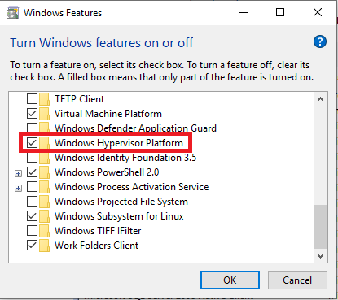
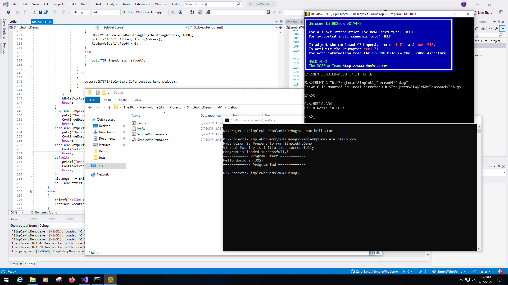

# SimpleWhpDemo
This project is a simple demo of running a real-mode DOS program in Windows 10 x64 by using Windows Hypervisor Platform (WHP).

## System Requirement
This project requires Windows 10 x64 1803 (Build 17134) or newer. \
Since this project relies on Microsoft Hypervisor, you will have to Install WHP in Control Panels.



## Build
To build this project, you are required to install [VS2019](https://visualstudio.microsoft.com/) and [Windows SDK](https://developer.microsoft.com/en-us/windows/downloads/windows-10-sdk/).

To build test cases, you are required to install [NASM](https://nasm.us/). \
Run the following command to build a test case:
```bat
nasm (source assembly file name) -o (output executable file name)
```

## Test
With a minimal analog firmware, SimpleWhpDemo is running a hello world program which is also capable to be running in a real DOS system. (The screenshot demonstrates the comparison to DOSBox)

You are required to build the analog firmware as well:
```bat
nasm ivt.asm -o ivt.fw
```
To run the DOS program:
```bat
SimpleWhpDemo ivt.fw hello.com
```


## License
This project is licensed under the MSPL License.